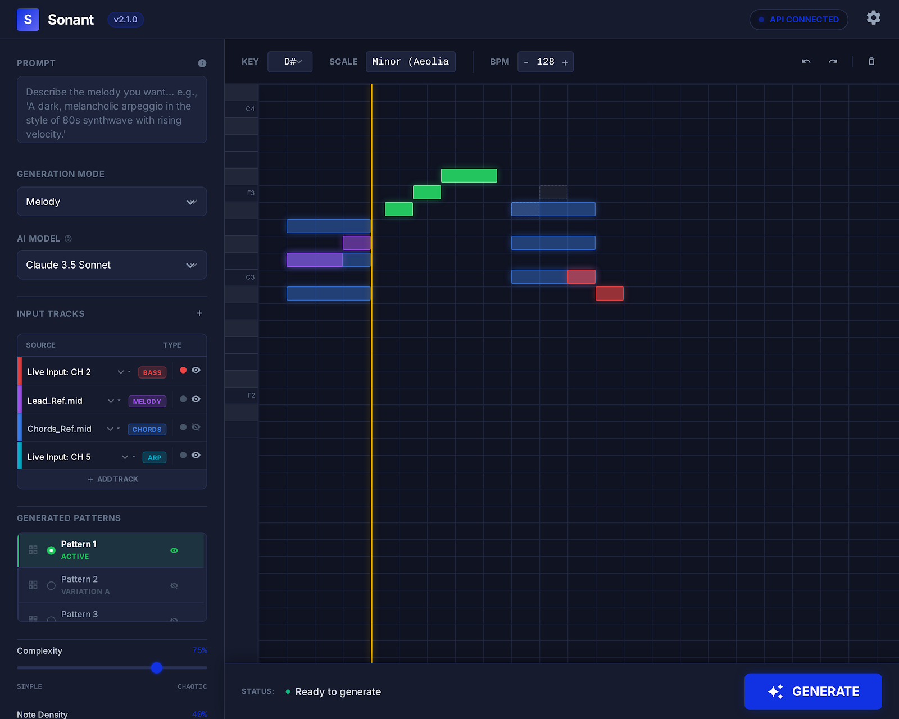
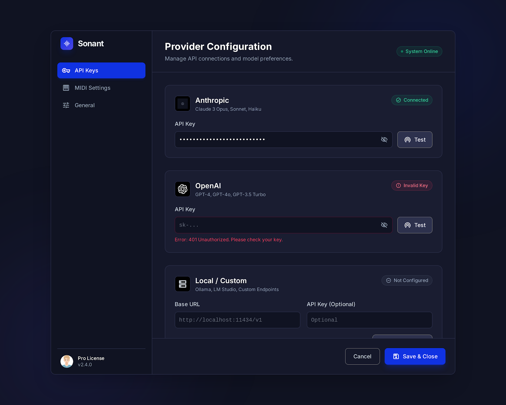

# Sonant — Product Requirements Document

## 1. プロダクト概要

| 項目 | 内容 |
|------|------|
| プロダクト名 | **Sonant** |
| 概要 | 自然言語プロンプトと参照MIDI（ファイル/リアルタイム入力）を入力として、AIがMIDIパターンを生成するCLAPオーディオプラグイン |
| プラグイン形式 | CLAP (Clever Audio Plugin) |
| プラグインカテゴリ | ユーティリティ（MIDI生成） |
| 対応プラットフォーム | Windows, macOS |
| 対応DAW | CLAP対応DAW全般（Bitwig Studio, REAPER, MultitrackStudio 等） |
| 開発言語 | Rust |
| 開発体制 | 個人開発 |
| ステージ | 新規開発（ゼロから） |

## 2. 課題と背景

DTM制作において、メロディやコード進行、ドラムパターンなどのMIDIフレーズを考える作業は時間がかかり、特にインスピレーションが湧かないときにワークフローが停滞する。既存のMIDI生成ツールはDAWとの統合が弱く、スタンドアロンアプリやWebサービスが中心であり、DAW内でシームレスに使えるものが少ない。

## 3. ターゲットユーザー

- DTMer（デスクトップミュージック制作者）
- DAW上で作曲・編曲作業を行うクリエイター
- アイデア出しやフレーズのバリエーション拡張を効率化したいユーザー

## 4. プロダクトビジョン

DAWのワークフローを離れることなく、自然言語と参照MIDI（既存ファイル/リアルタイム入力）を組み合わせた指示により、高速にMIDIパターンを生成・プレビュー・適用できるプラグインを実現する。

## 5. 使用パターン（Usage Patterns）

### UP-1: プロンプトからMIDI生成
1. ユーザーがSonantをDAWのトラックにインサートする
2. 生成モード（メロディ、コード進行等）を選択する
3. パラメーター（キー、テンポ、複雑度等）を設定する
4. 自然言語プロンプトを入力する（例：「明るいポップなメロディ、Cメジャー」）
5. 生成ボタンを押す
6. AIがMIDIパターンを生成し、ピアノロールでプレビュー表示される
7. ユーザーが確認し、DAWのトラックへMIDI出力する

### UP-2: 既存MIDIを参照して生成
1. ユーザーが参照用MIDIファイルをプラグインにセットする（メロディ、リズム、コード進行など）
2. 生成モードを選択する（例：カウンターメロディ生成、ハモリ生成）
3. プロンプトで追加指示を入力する（例：「3度上のハモリを付けて」）
4. 生成ボタンを押す
5. AIが参照MIDIを解析し、それに基づいたMIDIパターンを生成する
6. ピアノロールでプレビューし、DAWへ出力する

### UP-3: 続きを生成
1. ユーザーが途中まで作成したMIDIファイルをセットする
2. 「続きを生成」モードを選択する
3. プロンプトで方向性を指示する（例：「サビに向かって盛り上がる展開に」）
4. AIが既存パートの続きを生成する
5. プレビュー・確認後、DAWへ出力する

### UP-4: リアルタイム入力を参照して生成
1. ユーザーが入力種別（メロディ、コード等）の参照ソースを「リアルタイム入力」に設定する
2. 入力種別ごとにMIDI Channelを設定する（例：メロディ=Channel 1、コード=Channel 2）
3. MIDI ChannelごとにRecordingを有効化する
4. ユーザーがDAWまたはMIDIキーボードから演奏入力する
5. プロンプトで追加指示を入力して生成ボタンを押す
6. AIがリアルタイム入力を解析し、参照としてMIDIパターンを生成する
7. ピアノロールでプレビューし、DAWへ出力する

## 6. 目的・目標（Objectives）

| ID | 目標 | 指標 |
|----|------|------|
| O-1 | 迅速なワークフロー | プロンプト入力から生成結果のプレビューまで10秒以内 |
| O-2 | DAWシームレス統合 | DAWを離れずにMIDI生成〜適用が完結すること |
| O-3 | 多様な生成モード | 7種類以上の生成モードをサポート |
| O-4 | 直感的なUI | 初回使用時にマニュアルなしで基本操作が可能なこと |

## 7. 機能要件（Functional Requirements）

### 7.1 コア機能 — MUST

| ID | 機能 | 説明 | 優先度 |
|----|------|------|--------|
| FR-01 | CLAPプラグインホスト統合 | CLAP形式でDAWにロードされ、MIDIイベントを入出力できること | MUST |
| FR-02 | 自然言語プロンプト入力 | テキスト入力欄でユーザーが生成指示を自然言語で入力できること | MUST |
| FR-03 | MIDI入力ソース管理 | 参照用MIDIをファイル選択またはリアルタイム入力から設定できること | MUST |
| FR-03a | — ファイル入力 | 参照用MIDIファイル（メロディ、リズム、コード進行等）をドラッグ&ドロップまたはファイル選択でセットできること | MUST |
| FR-03b | — リアルタイム入力 | DAWまたはMIDIデバイスから入力されたMIDIを参照ソースとして取り込めること | MUST |
| FR-03c | — チャンネルマッピング | リアルタイム入力時に、入力種別ごとにMIDI Channelを選択できること（例：メロディ=Ch1、コード=Ch2） | MUST |
| FR-03d | — チャンネル別Recording設定 | リアルタイム入力時に、MIDI ChannelごとにRecording有効/無効を設定できること | MUST |
| FR-04 | AI生成エンジン（クラウドAPI） | Anthropic Claude API等のクラウドLLMを呼び出し、プロンプト＋参照MIDIからMIDIデータを生成すること | MUST |
| FR-05 | 生成モード選択 | 以下のモードを切り替え可能にすること | MUST |
| FR-05a | — メロディ生成 | 指定キー・スケール上でメロディラインを生成 | MUST |
| FR-05b | — コード進行生成 | コードパターンをMIDIノートとして生成 | MUST |
| FR-05c | — ドラムパターン生成 | GM準拠またはユーザー指定のドラムマップでリズムパターンを生成 | MUST |
| FR-05d | — ベースライン生成 | コード進行やメロディに合ったベースラインを生成 | MUST |
| FR-05e | — カウンターメロディ生成 | 既存メロディに対する対旋律を生成 | MUST |
| FR-05f | — ハモリ生成 | 既存メロディに対するハーモニーパートを生成 | MUST |
| FR-05g | — 続きを生成 | 既存MIDIの続きとなるフレーズを生成 | MUST |
| FR-06 | パラメーター設定 | テンポ/BPM、キー/スケール、ノート密度/複雑度を設定できること | MUST |
| FR-07 | ピアノロールプレビュー | 生成されたMIDIをピアノロール形式で視覚的にプレビューできること | MUST |
| FR-08 | MIDI出力 | 生成結果をDAWトラックへMIDIイベントとして出力できること | MUST |
| FR-09 | カスタムGUI | プラグイン独自のGUIウィンドウを提供すること | MUST |

### 7.2 重要機能 — SHOULD

| ID | 機能 | 説明 | 優先度 |
|----|------|------|--------|
| FR-10 | APIキー設定 | ユーザーが自身のクラウドAPIキーを設定・保存できること | SHOULD |
| FR-11 | 生成履歴 | 過去の生成結果を一覧表示し、再利用できること | SHOULD |
| FR-12 | 複数候補生成 | 1回のリクエストで複数のバリエーションを生成し、比較選択できること | SHOULD |
| FR-13 | MIDIファイルエクスポート | 生成結果を.midファイルとしてエクスポートできること | SHOULD |
| FR-14 | DAW同期 | DAWのテンポ・拍子情報を自動取得してパラメーターに反映すること | SHOULD |
| FR-15 | プリセットプロンプト | よく使うプロンプトをプリセットとして保存・呼び出しできること | SHOULD |

### 7.3 将来機能 — COULD

| ID | 機能 | 説明 | 優先度 |
|----|------|------|--------|
| FR-16 | リアルタイム生成 | 演奏中にリアルタイムでMIDIを生成・出力するモード | COULD |
| FR-17 | ローカルモデル対応 | クラウドAPI不要のローカル推論モード（ONNX等） | COULD |
| FR-18 | VST3 / AU対応 | CLAP以外のプラグイン形式への対応 | COULD |
| FR-19 | MIDIエフェクトチェーン | 生成後のMIDIに対してクオンタイズ・トランスポーズ等の後処理を適用 | COULD |

## 8. 非機能要件

| ID | 要件 | 説明 |
|----|------|------|
| NFR-01 | レイテンシ | API呼び出しから生成結果表示まで10秒以内（ネットワーク状況に依存） |
| NFR-02 | クロスプラットフォーム | Windows (x86_64) と macOS (x86_64 / ARM64) で動作すること |
| NFR-03 | メモリ使用量 | プラグイン単体で100MB以下のメモリ使用に収まること |
| NFR-04 | スレッド安全性 | オーディオスレッドをブロックしないこと（API呼び出しは別スレッドで実行） |
| NFR-05 | セキュリティ | APIキーをローカルに安全に保存すること（平文保存禁止） |

## 9. 技術スタック（想定）

| レイヤー | 技術 |
|----------|------|
| プラグインフレームワーク | clack (Rust CLAP bindings) または clap-sys |
| GUI | GPUI + GPUI Component（Zed発GPU加速UIフレームワーク + 60以上のUIコンポーネント） |
| AI推論 | Anthropic Claude API（HTTPS） |
| MIDIパース/解析 | midly / nodi + キー推定用外部ライブラリ |
| ビルド | cargo, cross-compilation for Windows/macOS |
| CI/CD | GitHub Actions |

## 10. GUI構成（基準UI）

以下の2画面をUI実装の基準とする。レイアウト、情報階層、主要な操作導線はこの画面構成に合わせる。

- メイン画面: `docs/image/sonant_main_plugin_interface/screen.png`
- 設定画面: `docs/image/sonant_api_&_model_settings/screen.png`

### 10.1 メインプラグイン画面

| エリア | 役割 | 関連FR |
|---|---|---|
| Header（ロゴ、API CONNECTED、Settings） | 接続状態の可視化と設定導線 | FR-09, FR-10 |
| Prompt / Generation Mode / AI Model | 生成指示、モード、使用モデルの入力 | FR-02, FR-04, FR-05 |
| Input Tracks | 参照MIDI入力の管理（ファイル/ライブ、監視、表示） | FR-03, FR-03a, FR-03b, FR-03c, FR-03d |
| Generated Patterns | 候補パターン選択、可視化切替、DAWへドラッグ導線 | FR-07, FR-08, FR-12 |
| Key / Scale / BPM + Complexity / Note Density | 生成パラメーター編集 | FR-06 |
| Piano Roll + Playhead | 生成結果プレビューと参照トラック重ね表示 | FR-07 |
| Status Bar + Generate CTA | 状態表示と生成実行 | FR-04, FR-09 |

### 10.2 API / Model Settings画面

| エリア | 役割 | 関連FR |
|---|---|---|
| Sidebar（API Keys / MIDI Settings / General） | 設定カテゴリ切替 | FR-09 |
| Provider Configuration（Anthropic/OpenAI/Local） | APIキー・接続先設定と疎通テスト | FR-10, FR-04 |
| Provider Status（Connected / Invalid Key / Not Configured） | 接続状態・エラーの即時フィードバック | FR-10 |
| Model Preferences（Default Model / Context Window） | 既定モデルと推論設定 | FR-04, FR-06 |
| Footer（Cancel / Save & Close） | 設定反映制御 | FR-09, FR-10 |

### 10.3 UI実装ルール

- 画面構成は `docs/image/*/screen.png` を基準とし、変更時は画像と仕様を同時更新する。
- 設定画面はメイン画面の設定アイコンから開き、保存後にメイン画面へ反映される。
- API接続状態は設定画面とメイン画面ヘッダーで一貫して表示する（例: `API CONNECTED`）。

## 11. 開発フェーズ（ロードマップ案）

### Phase 1: Foundation（MVP）
- CLAPプラグインの基本構造構築（ロード・MIDI I/O）
- GPUI + GPUI ComponentのCLAPプラグインGUI埋め込みPoC
- 最小限のGUI（プロンプト入力＋生成ボタン）
- Claude API連携によるMIDI生成（メロディ生成モードのみ）
- ピアノロールプレビュー（読み取り専用）

### Phase 2: Core Modes
- 全7生成モード実装
- MIDI入力ソース（ファイル/リアルタイム）対応
- 入力種別ごとのMIDI Channel設定UI
- MIDI ChannelごとのRecording有効/無効設定UI
- パラメーター設定UI
- MIDI出力（DAWトラックへ）

### Phase 3: Workflow Enhancement
- 複数候補生成＋比較選択
- 生成履歴
- プリセットプロンプト
- MIDIファイルエクスポート
- DAWテンポ同期

### Phase 4: Advanced（将来）
- リアルタイム生成モード
- ローカルモデル対応
- 他プラグイン形式対応

## 12. リスクと対策

| リスク | 影響 | 対策 |
|--------|------|------|
| API応答遅延 | ワークフロー停滞 | 非同期処理＋プログレス表示、キャッシュ活用 |
| APIコスト | ユーザー負担増 | 効率的なプロンプト設計、トークン使用量の最適化 |
| MIDI生成品質 | 使い物にならない出力 | プロンプトエンジニアリングの改善、参照MIDI活用による品質向上 |
| GPUI Windowsサポート | GPUIは現時点でmacOS/Linux向けが主でWindowsサポートが限定的 | GPUI一本方針を維持しつつ、Windowsでの制限事項を明文化して段階的に対応範囲を拡大 |
| CLAPプラグインへのGPUI組み込み | GPUIはスタンドアロンアプリ向け設計のため、プラグインGUIとしての統合に技術的課題の可能性 | 早期にCLAPホストウィンドウへのGPUI埋め込みPoC実施 |
| GUIフレームワーク固定による制約 | 将来的な拡張の柔軟性に影響 | UIコンポーネント境界を明確化し、将来の置換コストを低減 |
| CLAPエコシステムの成熟度 | 対応DAWが限定的 | 将来的にVST3/AU対応を視野に入れる |
| リアルタイム入力のチャンネル競合 | 誤った参照解析により生成品質が低下 | 入力種別ごとのチャンネルマッピングUIと重複検知バリデーションを実装 |

## 13. 仕様確定事項（2026-02-16）

- GUIフレームワークはGPUI一本で進める
- LLMの出力形式はJSON固定とする
- 生成履歴の初期保存形式はJSONLを採用する
- 参照MIDI解析のキー推定は外部ライブラリを採用する
- MIDI入力はファイル選択とリアルタイム入力の両方に対応する
- リアルタイム入力では入力種別ごとにMIDI Channelを設定可能とする
- リアルタイム入力ではMIDI ChannelごとにRecording有効/無効を設定可能とする
- UI実装は `docs/image/sonant_main_plugin_interface/screen.png` と `docs/image/sonant_api_&_model_settings/screen.png` を基準に進める

---

*最終更新: 2026-02-16*
